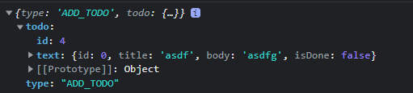

<br/>

## 오늘한 일

-    [항해 99] redux 개인 과제 추가하는 부분까지...완료...
-    [항해 99] redux 개인 과제 route 부분 완료(1차)
-    [도서] 혼공스 8-번 1회독 + 내용 정리

<br/>

## 내일 할 일

-    [노마드코더] hooks 다보기
-    [항해 99] redux 개인 과제 끝내기
-    [항해 99] redux 코드리뷰 가능할 정도로 정리하기
-    [리덕스 사이트] 튜토리얼 해보기

<br/>

<br/>

## **오늘 공부 내용 간단 정리!**

<br/>

### redux 오늘 무한 오류의 주범

<br/>



<br/>

todo를 보면 id, text가 나눠져 있고 text 안에 배열로 입력될 객체가 들어가 있는데..
이게 원래는 text 안에 있는 id에 밖에 나와있는 id(배열의 객체가 늘어날 때마다 id 값이 1씩 증가하는 값)를 넣고 싶었다. 저거 때문에 아마 4-5시간정도..? 구글링을 한 것 같은데..
<br/>

결과적으로 문제는 redux에서 ADD_TODO를 선언하여 액션 객체 함수를 만들어 줄 때 아래의 오류 발생 함수처럼 todo로 묶어준게 문제였다. 생각 없이 구글링만 하다보니 겪게 된 오류.. 생각보다 해결이 쉬워서 기분이 묘했다.

<br/>

```javascript
//오류 발생
export const addTodo = (text) => ({
     type: ADD_TODO,
     todo: { id: id++, text },
});
//오류 해결
export const addTodo = (text) => ({
     type: ADD_TODO,
     id: id++,
     text,
});
```

<br/>

### 구문 오류와 예외

-    프로그램 실행 전에 발생하는 오류 : 구문 오류(syntax error)
-    프로그램 실행 중이 발생하는 오류 : 예외(exception) or 런타임 오류(runtime error)
<hr>
<br/>
<br/>

1. 오늘부터 진짜 열심히 할거라고 마음먹고 공부했는데.. redux에 제대로 진입한 순간 모든게 망해버렸다. 저장되는 값이 숫자일 때와 배열일 때 접근 난이도는 상상 이상으로 달랐고, 분명 이해했다고 생각한 부분들도 뇌정지가 오면서 다 얽혀버렸다.
2. 그 와중에 질문 타임 때 매니저님께 어려운 부분을 질문하는데... 자꾸 되묻는 질문을 해주시다보니 완전 멘붕에 빠졌고,,,, 그러다 보니 머릿속이 뒤죽박죽이 되어버려서 정리가 되지않고 너무 쪽팔렸다 ㅎ 조원들은 이미 다 했던뎅... 이해 못하는 내가 너무 싫었다 ☹
3. 나 다시 걷기 반으로 보내줘............................... 내 자존감 다 어디감
4. 살면서 이렇게 열심히 할 수가 있나 싶을 정도로 열심히 하는 것 같은데 하는 만큼 안나오니까 너무 속상하다. 오늘까지만 속상해하기!~!!!!! 강철 멘탈로 단단해지는 그날까지~!~!~
